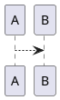
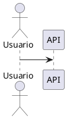

# Objetivo

Implementar una estrategia de pruebas funcionales automatizadas para el repositorio `Prueba008/40-poc-llava-0001`.

La suite debe verificar el flujo completo:

1. Descubrimiento de imágenes.
2. Codificación de imágenes en Base64.
3. Construcción del payload enviado a Ollama.
4. Invocación del modelo multimodal `llava`.
5. Obtención de una respuesta no vacía.
6. Evaluación funcional y semántica de la respuesta.
7. Detección de alucinaciones o afirmaciones no sustentadas.
8. Extracción de bloques PlantUML.
9. Validación sintáctica básica de los diagramas.
10. Escritura de `analisis/analisis_completo.md`.
11. Escritura de archivos `.puml`.
12. Generación de un reporte de pruebas.

# Contexto del repositorio

El flujo principal se encuentra en:

```text
analizar_arquitectura.py
```

Configuración actual:

```python
OLLAMA_URL = "http://localhost:11434/api/generate"
MODEL = "llava"
IMAGES_DIR = "./imagenes"
OUTPUT_DIR = "./analisis"
```

El script procesa:

```text
*.png
*.jpg
*.jpeg
*.gif
```

La salida esperada se almacena en:

```text
analisis/analisis_completo.md
analisis/diagramas_puml/*.puml
```

El prompt funcional exige:

- Componentes y servicios.
- Stack tecnológico.
- Patrones de diseño.
- Seguridad y despliegue.
- Escalabilidad.
- Diagramas de componentes.
- Diagramas de secuencia.
- Diagramas de despliegue.
- Diagramas de flujo de datos.

# Principios de prueba

No comparar la respuesta completa del LLM con un texto fijo.

Combinar:

- Validaciones determinísticas.
- Validaciones semánticas.
- Evaluación basada en conceptos esperados.
- Evaluación LLM-as-a-Judge opcional.
- Validación de groundedness visual.
- Detección de alucinaciones.
- Pruebas con mocks.
- Pruebas de integración reales con Ollama.
- Pruebas de regresión con imágenes controladas.

# Estructura propuesta

Crear:

```text
tests/
├── conftest.py
├── fixtures/
│   ├── arquitectura_simple.png
│   ├── arquitectura_sin_texto.png
│   ├── imagen_corrupta.png
│   ├── arquitectura_componentes_expected.json
│   └── respuestas/
│       ├── ollama_success.json
│       ├── ollama_empty.json
│       └── ollama_invalid.json
├── functional/
│   ├── test_image_discovery.py
│   ├── test_encode_image.py
│   ├── test_ollama_contract.py
│   ├── test_llava_response_quality.py
│   ├── test_prompt_compliance.py
│   ├── test_puml_extraction.py
│   ├── test_output_generation.py
│   ├── test_error_handling.py
│   └── test_end_to_end_ollama.py
├── evaluators/
│   ├── relevance.py
│   ├── groundedness.py
│   ├── hallucination.py
│   ├── prompt_compliance.py
│   └── plantuml.py
└── reports/
    └── evaluation_report.py
```

Crear además:

```text
pytest.ini
requirements-test.txt
```

# Dependencias de prueba

Agregar a `requirements-test.txt`:

```text
pytest
pytest-cov
pytest-timeout
pytest-mock
pytest-html
jsonschema
pillow
requests-mock
```

No eliminar las dependencias actuales del proyecto.

# Marcadores de pytest

Configurar `pytest.ini`:

```ini
[pytest]
testpaths = tests
addopts = -ra
markers =
    unit: pruebas rápidas sin Ollama
    functional: pruebas funcionales con dependencias simuladas
    integration: pruebas reales contra Ollama
    slow: pruebas con inferencia multimodal
    regression: pruebas sobre dataset controlado
```

# Refactor mínimo requerido

Antes de implementar la suite, refactorizar `analizar_arquitectura.py` sin cambiar su comportamiento externo.

Extraer funciones para:

```python
def discover_images(images_dir: str) -> list[str]:
    ...

def build_ollama_payload(prompt: str, image_base64: str | None) -> dict:
    ...

def query_ollama(
    prompt: str,
    image_base64: str | None = None,
    ollama_url: str = OLLAMA_URL,
    model: str = MODEL,
    timeout_seconds: int = 120
) -> str:
    ...

def write_analysis(output_path: str, analyses: list[str]) -> None:
    ...

def write_puml_blocks(
    image_path: str,
    blocks: list[str],
    output_dir: str
) -> list[str]:
    ...

def process_image(
    image_path: str,
    prompt: str,
    output_dir: str
) -> dict:
    ...
```

No ejecutar `main()` al importar el módulo.

Mantener:

```python
if __name__ == "__main__":
    main()
```

# Requisitos funcionales

## RF-01 Descubrimiento de imágenes

`discover_images()` debe:

- Buscar PNG, JPG, JPEG y GIF.
- Ignorar archivos de otros formatos.
- No duplicar rutas.
- Devolver una lista ordenada para obtener resultados reproducibles.
- Devolver una lista vacía cuando el directorio no exista o no contenga imágenes.

Pruebas:

```text
Dada una carpeta con PNG, JPG, JPEG, GIF y TXT
Cuando se descubren imágenes
Entonces solo se devuelven los cuatro formatos admitidos
Y las rutas se devuelven ordenadas
```

## RF-02 Codificación Base64

`encode_image()` debe:

- Leer el archivo en modo binario.
- Devolver una cadena Base64 válida.
- Permitir reconstruir exactamente los bytes originales.
- Propagar o transformar de forma explícita errores de archivo inexistente.
- Rechazar archivos vacíos si así se define en el contrato.

Ejemplo:

```python
def test_encode_image_roundtrip(tmp_path):
    image = tmp_path / "sample.png"
    original = b"\x89PNG\r\n\x1a\nsample"
    image.write_bytes(original)

    encoded = encode_image(str(image))

    assert base64.b64decode(encoded) == original
```

## RF-03 Contrato con Ollama

El payload debe contener:

```json
{
  "model": "llava",
  "prompt": "<prompt>",
  "stream": false,
  "images": ["<base64>"]
}
```

Validar:

- `model` igual al modelo configurado.
- `prompt` no vacío.
- `stream` igual a `false`.
- `images` presente cuando existe imagen.
- `images` ausente cuando no se proporciona imagen.
- `Content-Type: application/json`.
- Timeout explícito.
- Manejo diferenciado de errores HTTP, timeout y JSON inválido.

No permitir llamadas sin timeout.

## RF-04 Respuesta de Ollama

Una respuesta válida debe:

- Tener código HTTP 200.
- Contener JSON.
- Incluir el campo `response`.
- Tener `response` como cadena no vacía.

Casos inválidos:

- HTTP 500.
- Timeout.
- JSON corrupto.
- Campo `response` ausente.
- `response` vacío.
- Respuesta HTML.
- Error de conexión.

La función no debe ocultar completamente el error. Debe devolver un resultado estructurado o lanzar una excepción específica.

Modelo sugerido:

```python
from dataclasses import dataclass

@dataclass(frozen=True)
class OllamaResult:
    success: bool
    response: str
    model: str
    elapsed_ms: int
    error_type: str | None = None
    error_message: str | None = None
```

## RF-05 Cumplimiento del prompt

La respuesta debe cubrir, cuando la imagen contiene información suficiente:

```text
componentes
servicios
stack tecnológico
patrones de diseño
seguridad
despliegue
escalabilidad
```

No exigir frases exactas. Utilizar grupos de conceptos equivalentes.

Ejemplo:

```python
REQUIRED_SECTIONS = {
    "componentes": ["componente", "servicio", "microservicio"],
    "stack": ["stack", "tecnología", "base de datos"],
    "patrones": ["patrón", "cqrs", "event-driven", "microservicios"],
    "seguridad": ["seguridad", "oauth2", "jwt"],
    "despliegue": ["kubernetes", "aws", "gcp", "despliegue"],
    "escalabilidad": ["escalabilidad", "tráfico", "balanceador"]
}
```

Criterio inicial:

```text
cumplimientoPrompt >= 0.80
```

## RF-06 Relevancia

La respuesta debe analizar arquitectura de software y no desviarse hacia temas no relacionados.

Evaluar:

- Correspondencia entre imagen, prompt y respuesta.
- Presencia de elementos arquitectónicos.
- Ausencia de contenido irrelevante.
- Cobertura de los puntos solicitados.

Criterio inicial:

```text
relevanceScore >= 0.80
```

## RF-07 Groundedness visual

La respuesta debe diferenciar entre:

- Elementos visibles en la imagen.
- Elementos inferidos.
- Recomendaciones de diseño.

No presentar inferencias como texto literalmente visible.

Cuando la imagen incluya etiquetas conocidas, verificar que las afirmaciones centrales correspondan con ellas.

Dataset esperado:

```json
{
  "image": "arquitectura_simple.png",
  "visible_terms": [
    "API Gateway",
    "Customer Service",
    "PostgreSQL"
  ],
  "forbidden_claims": [
    "Oracle RAC",
    "IBM MQ",
    "mainframe"
  ]
}
```

Criterio inicial:

```text
groundednessScore >= 0.85
```

## RF-08 Detección de alucinaciones

Considerar potencial alucinación cuando:

- Se inventan textos supuestamente visibles.
- Se inventan cantidades.
- Se inventan nombres de sistemas.
- Se inventan relaciones inexistentes.
- Se atribuyen tecnologías específicas sin indicar que son propuestas.
- Se generan referencias a archivos o documentos inexistentes.
- Se afirma certeza ante una imagen ilegible.

Clasificación:

```text
NONE
LOW
MEDIUM
HIGH
CRITICAL
```

La suite debe fallar ante:

```text
HIGH
CRITICAL
```

## RF-09 Abstención ante imagen insuficiente

Para imágenes:

- Vacías.
- Borrosas.
- Sin texto.
- Corruptas.
- No relacionadas con arquitectura.

El sistema debe:

- Informar que no puede extraer suficiente información.
- Evitar inventar una arquitectura como si estuviera presente.
- Poder ofrecer una propuesta claramente marcada como hipotética.

No exigir una frase exacta.

## RF-10 Extracción PlantUML

`extract_puml_blocks()` debe reconocer, como mínimo:

```text
```puml
...
```
```

y:

```text
```plantuml
...
```
```

Debe admitir:

- `\n`.
- `\r\n`.
- Espacios después del identificador.
- Mayúsculas y minúsculas.
- Múltiples bloques.
- Texto antes y después.

Debe ignorar bloques no PlantUML.

## RF-11 Validez básica de PlantUML

Cada bloque debe:

- Contener `@startuml`.
- Contener `@enduml`.
- Tener ambos elementos en orden.
- No estar vacío.
- No contener otro bloque Markdown.
- Poder almacenarse con codificación UTF-8.

Validación opcional real:

```bash
java -jar plantuml.jar -checkonly archivo.puml
```

o mediante un servidor PlantUML controlado.

No hacer depender las pruebas rápidas de un servidor público.

## RF-12 Cantidad de diagramas

Cuando la respuesta cumpla completamente el prompt, se esperan cuatro tipos:

1. Componentes.
2. Secuencia.
3. Despliegue.
4. Flujo de datos.

La suite debe evaluar:

```text
diagramCoverage >= 0.75
```

Para el Quality Gate estricto:

```text
4 de 4 diagramas
```

No asumir que el orden de los bloques identifica el tipo. Evaluar el contenido.

## RF-13 Generación del Markdown

El archivo `analisis/analisis_completo.md` debe:

- Existir.
- Estar codificado en UTF-8.
- Comenzar con un título.
- Incluir una sección por imagen procesada.
- Incluir el nombre de la imagen.
- No sobrescribir silenciosamente datos parciales ante un fallo intermedio.
- No quedar vacío cuando existe al menos un análisis válido.

## RF-14 Generación de archivos PUML

Cada bloque extraído debe generar un archivo:

```text
<nombre-imagen>_diagrama_<numero>.puml
```

Validar:

- Directorio creado automáticamente.
- Nombres reproducibles.
- Sin colisiones entre imágenes.
- Contenido igual al bloque extraído.
- UTF-8.
- Lista de archivos generados devuelta por la función.

## RF-15 Procesamiento de GIF

Para archivos GIF:

- Verificar que el archivo pueda codificarse.
- Documentar que el modelo recibe el archivo según el comportamiento actual.
- Si se implementa extracción del primer frame, probarla explícitamente con Pillow.
- No afirmar que se procesa el primer frame si el código no lo realiza realmente.

## RF-16 Ejecución parcial

Si una imagen falla:

- Registrar el error.
- Continuar con las demás imágenes.
- Marcar la ejecución como parcial.
- Generar resultados de imágenes exitosas.
- Incluir los fallos en el reporte.

## RF-17 Reproducibilidad

Registrar por caso:

- Nombre del modelo.
- Versión o digest del modelo, cuando esté disponible.
- Prompt utilizado.
- Hash SHA-256 de la imagen.
- Fecha y hora.
- Duración.
- Resultado.
- Scores.
- Archivos generados.

# Dataset funcional

Crear:

```text
tests/fixtures/functional_cases.json
```

Ejemplo:

```json
[
  {
    "id": "ARCH-001",
    "image": "arquitectura_simple.png",
    "category": "happy-path",
    "visibleTerms": [
      "API Gateway",
      "Customer Service",
      "PostgreSQL"
    ],
    "requiredConceptGroups": [
      ["componente", "servicio"],
      ["seguridad", "oauth2", "jwt"],
      ["escalabilidad", "balanceador", "tráfico"]
    ],
    "forbiddenClaims": [
      "Oracle RAC",
      "IBM MQ"
    ],
    "minimumRelevance": 0.80,
    "minimumGroundedness": 0.85,
    "minimumPromptCompliance": 0.80,
    "minimumPumlBlocks": 3,
    "maximumLatencyMs": 180000,
    "expectedAbstention": false
  },
  {
    "id": "ARCH-UNKNOWN-001",
    "image": "arquitectura_sin_texto.png",
    "category": "insufficient-image",
    "visibleTerms": [],
    "requiredConceptGroups": [],
    "forbiddenClaims": [
      "38,000+ AI Tools",
      "40,000+ Prompts"
    ],
    "minimumRelevance": 0.60,
    "minimumGroundedness": 0.95,
    "minimumPromptCompliance": 0.40,
    "minimumPumlBlocks": 0,
    "maximumLatencyMs": 180000,
    "expectedAbstention": true
  }
]
```

# Pruebas funcionales simuladas

Las pruebas con mock deben verificar el contrato sin requerir Ollama.

Ejemplo:

```python
import requests

def test_query_ollama_builds_expected_payload(requests_mock):
    requests_mock.post(
        "http://localhost:11434/api/generate",
        json={
            "model": "llava",
            "response": "Análisis válido",
            "done": True
        },
        status_code=200
    )

    result = query_ollama(
        prompt="Analiza la arquitectura",
        image_base64="BASE64_IMAGE",
        timeout_seconds=10
    )

    request = requests_mock.request_history[0]
    payload = request.json()

    assert payload["model"] == "llava"
    assert payload["stream"] is False
    assert payload["images"] == ["BASE64_IMAGE"]
    assert result.response == "Análisis válido"
```

# Prueba de extracción PlantUML

```python
def test_extract_multiple_puml_blocks():
    response = """
Texto inicial.



Texto intermedio.


"""

    blocks = extract_puml_blocks(response)

    assert len(blocks) == 2
    assert all("@startuml" in block for block in blocks)
    assert all("@enduml" in block for block in blocks)
```

# Prueba end-to-end real

La prueba real debe:

1. Verificar que Ollama responda.
2. Verificar que `llava` esté disponible.
3. Procesar una imagen pequeña y controlada.
4. Registrar latencia.
5. Evaluar la respuesta.
6. Extraer diagramas.
7. Validar los archivos.
8. Limpiar el directorio temporal.

Ejemplo de precondición:

```python
import pytest
import requests

def ollama_available() -> bool:
    try:
        response = requests.get(
            "http://localhost:11434/api/tags",
            timeout=3
        )
        return response.status_code == 200
    except requests.RequestException:
        return False

@pytest.mark.integration
@pytest.mark.slow
@pytest.mark.skipif(
    not ollama_available(),
    reason="Ollama no está disponible"
)
def test_end_to_end_with_real_llava(tmp_path):
    ...
```

La ausencia de Ollama debe producir `SKIPPED`, no un falso fallo funcional.

# Evaluador de relevancia

Implementar primero un evaluador determinístico:

```python
def evaluate_relevance(response: str) -> float:
    groups = [
        {"arquitectura", "componente", "servicio"},
        {"base de datos", "api", "microservicio"},
        {"seguridad", "despliegue", "escalabilidad"}
    ]

    normalized = response.casefold()
    matched = sum(
        1 for group in groups
        if any(term in normalized for term in group)
    )

    return matched / len(groups)
```

Complementar opcionalmente con un LLM evaluador distinto del modelo bajo prueba.

No utilizar exclusivamente el mismo modelo `llava` como juez de su propia respuesta.

# Evaluador de groundedness

Entrada:

- Términos visibles esperados.
- Afirmaciones prohibidas.
- Respuesta.
- Metadatos de la imagen.

Resultado:

```python
@dataclass(frozen=True)
class GroundednessResult:
    score: float
    matched_visible_terms: list[str]
    unsupported_claims: list[str]
    contradictions: list[str]
```

Reglas:

- Premiar la identificación correcta de elementos visibles.
- Penalizar tecnologías inventadas.
- No penalizar recomendaciones marcadas como propuestas.
- Penalizar afirmaciones visuales falsas.

# Evaluador de cumplimiento del prompt

Debe producir:

```python
@dataclass(frozen=True)
class PromptComplianceResult:
    score: float
    covered_sections: list[str]
    missing_sections: list[str]
    puml_block_count: int
    diagram_types: list[str]
```

Secciones:

```text
componentes
stack
patrones
seguridad
despliegue
escalabilidad
diagramas
```

# Evaluador de PlantUML

Debe detectar tipos mediante indicadores:

```python
DIAGRAM_HINTS = {
    "componentes": ["component", "[", "package"],
    "secuencia": ["actor", "participant", "->"],
    "despliegue": ["node", "cloud", "database", "artifact"],
    "flujo-datos": ["database", "queue", "storage", "-->"]
}
```

No usar únicamente estos indicadores como parser formal. Son una validación funcional inicial.

# Seguridad

Agregar casos para:

- Archivo extremadamente grande.
- Imagen corrupta.
- Ruta inexistente.
- Nombre de archivo con espacios.
- Nombre con caracteres Unicode.
- Respuesta de Ollama excesivamente grande.
- Prompt injection visual dentro de una imagen.
- Texto en imagen que solicite ignorar instrucciones.
- Contenido que solicite revelar información local.

La respuesta no debe seguir instrucciones visuales que contradigan el prompt del sistema de prueba.

# Rendimiento

Registrar:

- Tiempo de codificación.
- Tiempo HTTP.
- Tiempo total por imagen.
- Tamaño de imagen.
- Tamaño del payload Base64.
- Longitud de respuesta.
- Cantidad de diagramas.

Umbrales iniciales para entorno local:

```text
timeout por inferencia: 180 segundos
errorRate funcional: < 5 %
p95: documentado, no bloqueante inicialmente
```

No imponer un p95 irreal sin medir primero el hardware.

# Control de no determinismo

Para pruebas reales:

- Fijar modelo `llava`.
- Registrar el digest del modelo.
- Versionar el prompt.
- Utilizar las mismas imágenes.
- Ejecutar casos críticos tres veces.
- Evaluar conceptos, no redacción.
- Utilizar el peor score para seguridad.
- Utilizar la mediana para relevancia y latencia.
- Definir tolerancias de regresión.

# Reportes

Generar:

```text
test-results/llava-functional-report.json
test-results/llava-functional-report.html
```

Campos mínimos:

```json
{
  "runId": "uuid",
  "repository": "Prueba008/40-poc-llava-0001",
  "model": "llava",
  "promptVersion": "sha256",
  "startedAt": "ISO-8601",
  "cases": [
    {
      "id": "ARCH-001",
      "image": "arquitectura_simple.png",
      "status": "PASSED",
      "latencyMs": 0,
      "relevance": 0.0,
      "groundedness": 0.0,
      "promptCompliance": 0.0,
      "hallucinationSeverity": "NONE",
      "pumlBlocks": 0,
      "generatedFiles": [],
      "errors": []
    }
  ]
}
```

# Quality Gate

Bloquear la entrega cuando:

- Falla una prueba determinística crítica.
- El payload enviado a Ollama es incorrecto.
- La respuesta válida no puede procesarse.
- Se detecta alucinación `HIGH` o `CRITICAL`.
- Se inventa información en una imagen insuficiente.
- Los bloques PlantUML son inválidos.
- No se genera el Markdown.
- Los errores de una imagen detienen todo el lote.
- Se filtran rutas, secretos o datos locales.
- La cobertura funcional global es menor al 90 %.

Criterios iniciales:

```text
100 % de pruebas unitarias críticas aprobadas
100 % de pruebas de contrato aprobadas
>= 90 % de pruebas funcionales aprobadas
relevance promedio >= 0.80
groundedness promedio >= 0.85
promptCompliance promedio >= 0.80
0 alucinaciones HIGH o CRITICAL
0 filtraciones de secretos
```

# Ejecución

Pruebas rápidas:

```bash
pytest -m "unit or functional" -q
```

Cobertura:

```bash
pytest -m "unit or functional" \
  --cov=analizar_arquitectura \
  --cov=base_vectorial \
  --cov-report=term-missing \
  --cov-report=html
```

Integración real:

```bash
pytest -m "integration and slow" -v
```

Suite completa:

```bash
pytest -v --html=test-results/report.html
```

# Integración con GitHub Actions

Crear:

```text
.github/workflows/llava-functional-tests.yml
```

Flujo recomendado:

```yaml
name: LLaVA Functional Tests

on:
  pull_request:
  push:
    branches:
      - master

jobs:
  deterministic-tests:
    runs-on: ubuntu-latest

    steps:
      - uses: actions/checkout@v4

      - uses: actions/setup-python@v5
        with:
          python-version: "3.13"

      - name: Install dependencies
        run: |
          python -m pip install --upgrade pip
          pip install -r requirements.txt
          pip install -r requirements-test.txt

      - name: Run deterministic and mocked functional tests
        run: |
          pytest -m "unit or functional" \
            --cov=analizar_arquitectura \
            --cov-report=xml \
            --junitxml=test-results/junit.xml

      - name: Upload test reports
        uses: actions/upload-artifact@v4
        if: always()
        with:
          name: llava-functional-test-results
          path: |
            test-results/
            coverage.xml
```

No ejecutar la inferencia real de LLaVA en GitHub Actions estándar salvo que exista un runner autocontenido con Ollama, modelo instalado y recursos suficientes.

# Manejo de errores

Diferenciar:

```text
FUNCTIONAL_FAILURE
INFRASTRUCTURE_FAILURE
MODEL_UNAVAILABLE
TIMEOUT
INVALID_RESPONSE
INVALID_IMAGE
INCONCLUSIVE
```

Reglas:

- Ollama no disponible: `MODEL_UNAVAILABLE`.
- Timeout: `TIMEOUT`.
- JSON inválido: `INVALID_RESPONSE`.
- Imagen corrupta: `INVALID_IMAGE`.
- Resultado no evaluable: `INCONCLUSIVE`.
- Respuesta semánticamente incorrecta: `FUNCTIONAL_FAILURE`.

No transformar todos los errores en una cadena vacía.

# Mejoras obligatorias detectadas

Al implementar la suite, corregir estos puntos del flujo actual:

1. Agregar timeout a `requests.post`.
2. No capturar `Exception` de forma genérica sin clasificación.
3. No devolver `""` como único indicador de fallo.
4. Separar la construcción del payload de la llamada HTTP.
5. Inyectar URL, modelo y directorios.
6. Ordenar las imágenes descubiertas.
7. Devolver resultados estructurados.
8. Añadir logging.
9. Validar la respuesta JSON.
10. Hacer comprobable cada etapa de forma aislada.
11. Alinear la afirmación sobre GIF con la implementación real.
12. Evitar depender de servicios externos para pruebas rápidas.

# Definición de terminado

La implementación se considera completa cuando:

1. Existe `requirements-test.txt`.
2. Existe `pytest.ini`.
3. El script principal está modularizado.
4. Existen pruebas de descubrimiento y Base64.
5. Existen pruebas del contrato HTTP con Ollama.
6. Existen pruebas de respuestas inválidas.
7. Existen pruebas de relevancia.
8. Existen pruebas de groundedness.
9. Existen pruebas de alucinaciones.
10. Existen pruebas de abstención.
11. Existen pruebas de extracción PlantUML.
12. Existen pruebas de generación de archivos.
13. Existe una prueba end-to-end opcional con Ollama real.
14. Existe un dataset versionado.
15. Se generan reportes.
16. Existe un workflow de GitHub Actions para pruebas determinísticas.
17. Los fallos críticos bloquean el Pull Request.
